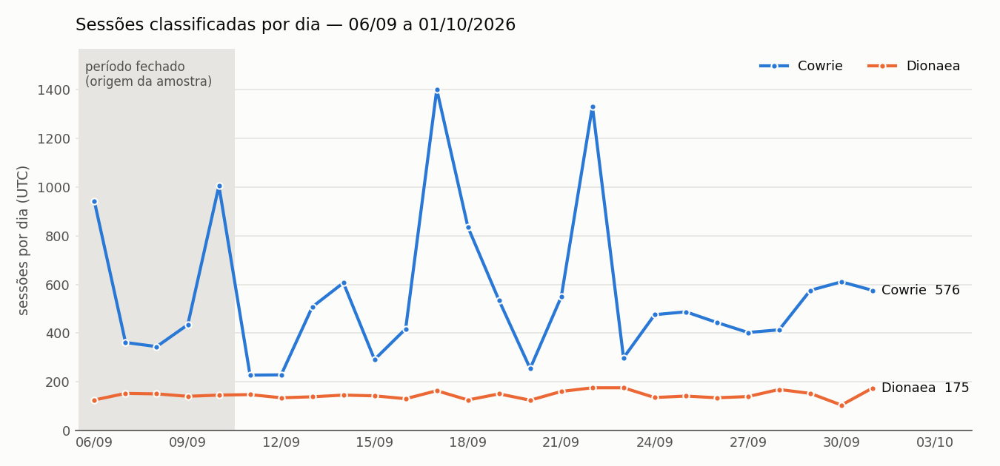

# Atualização ao orientador — 02/10/2026

Complementa o [relatório técnico de 10/09](entrega-professor-pablo.md). Registra
o que mudou desde então, o estado da avaliação dos classificadores e as decisões
que dependem do orientador. As seções marcadas **[A PREENCHER]** dependem da
rotulagem manual, que ainda não terminou. Nenhum número delas foi estimado.

---

## 1. Resumo

| | 10/09/2026 | 02/10/2026 |
|---|---|---|
| Rotulagem manual da amostra | 0 de 200 | 0 de 200 (ferramenta pronta) |
| Coleta | 4,75 dias, 3.118 sessões elegíveis | **26,7 dias, 19.283 sessões elegíveis**, em andamento |
| Classes do Cowrie nunca previstas | `command_injection`, `malware_download` | nenhuma: 3 e 17 sessões, respectivamente |
| Monitor de integridade | operacional | falso-positivo de 24/09 a 02/10, corrigido |

Três achados novos mudam a leitura da avaliação:

1. **A amostra de 10/09 não cobre as classes raras do Cowrie.** Elas só aparecem
   depois do fechamento do período (seção 2).
2. **Cerca de metade das sessões Cowrie da amostra não cabe em nenhuma classe do
   modelo** (seção 4.2).
3. **A apuração misturava os dois modelos numa só matriz.** Corrigido (seção 4.3).

---

## 2. Coleta estendida

Números extraídos em 02/10/2026 às 17:39 UTC com `relatorio_coleta.py`, banco
aberto somente leitura, `PRAGMA quick_check` = `ok`.

| | |
|---|---|
| Início (UTC) | 2026-09-06T01:10:31Z |
| Último registro (UTC) | 2026-10-02T17:39:39Z |
| Duração | 26,69 dias |
| Sessões no banco | 19.291 |
| Sessões próprias excluídas | 8 |
| **Elegíveis** | **19.283** |
| IPs distintos | 4.971 |
| Lacunas acima de 3 h sem sessão | **0** |



O dia 02/10 ficou fora do gráfico por estar incompleto. A faixa cinza é o
período fechado em 10/09, de onde saiu a amostra de avaliação. Os picos do Cowrie
em 17/09 e 22/09 ainda não foram investigados.

### Classes previstas no período inteiro

Isto é o que o modelo disse, sem conferência humana. **Não é acurácia.**

| Honeypot | Classe prevista | Até 10/09 | Até 02/10 | Confiança média |
|---|---|---:|---:|---:|
| Cowrie | brute_force | 2.385 | 14.917 | 0,642 |
| Cowrie | recon | 54 | 354 | 0,751 |
| Cowrie | malware_download | **0** | **17** | 0,657 |
| Cowrie | command_injection | **0** | **3** | 0,302 |
| Dionaea | service_probe | 627 | 3.772 | 0,896 |
| Dionaea | credential_bruteforce | 32 | 109 | 0,920 |
| Dionaea | connection_flood | 14 | 66 | 0,892 |
| Dionaea | port_scan | 4 | 28 | 0,726 |
| Dionaea | malware_download | 1 | 11 | 0,802 |
| Dionaea | exploit_attempt | 1 | 6 | 0,631 |

O desbalanceamento se manteve: 97,6% das sessões do Cowrie seguem em
`brute_force`. As 3 sessões de `command_injection` têm confiança média de 0,30,
a mais baixa de todas as classes.

---

## 3. Monitoramento

De 24/09 a 02/10 o monitor de integridade falhou a cada hora (191 vezes) e gerou
um email por falha. A causa foi confirmada no journal da VM: um login SSH
administrativo fez o próprio Amazon Linux regravar `/boot/grub2/grubenv`, o que é
comportamento normal do sistema. Não houve invasão, reboot nem instalação de
pacote.

Em 02/10 o monitor passou a ignorar o conteúdo desse arquivo, mas não seus
metadados. Os alertas de falha ficaram limitados a um por serviço a cada 6 h, e
a referência de integridade foi renovada, com a anterior arquivada no S3. A coleta
não foi interrompida. Detalhes, hashes e procedimento em
[contenção e alertas](contencao-e-alertas.md).

---

## 4. Avaliação dos classificadores

### 4.1 Ferramenta de revisão cega

A rotulagem é feita numa tela do próprio dashboard (menu **Rotulagem**). Ela
mostra cada sessão com seus eventos brutos (usuários e senhas tentados, comandos,
serviços e portas) e **não mostra a previsão do modelo**: a API dessa tela nem lê
`previsoes.csv`. Os revisores são Mayron (revisor 1) e Caio (revisor 2). Como
funciona:

- Cada revisor vê as 200 sessões numa ordem embaralhada própria.
- Os rótulos de um revisor nunca são devolvidos ao outro. Ficam em
  `data/avaliacao/rotulos/<revisor>.json` na VM, fora do git, e entram no backup
  externo.
- As outras telas do painel mostram a classe prevista; os revisores foram
  orientados a não abri-las até terminar. Esse cegamento depende da disciplina
  deles e deve constar como limitação.
- Os eventos foram extraídos dos logs brutos por
  `exportar_evidencias_revisao.py` e preservados em
  `data/avaliacao/evidencias_revisao.json`, porque os logs rotacionam. O arquivo
  fica fora do repositório público (ver seção 7).
- As 200 sessões tiveram eventos encontrados no log, nenhuma ficou sem lastro.
- `importar_rotulos.py` grava os rótulos em `revisao_cega.csv` e recusa rótulo de
  outra taxonomia, revisor duplicado e sobrescrita silenciosa.

### 4.2 Achado: a taxonomia do Cowrie não cobre o tráfego real

Contagem feita nos eventos brutos das 134 sessões Cowrie da amostra:

| Interação observada | Sessões | % |
|---|---:|---:|
| Nenhum login e nenhum comando (conexão aberta e fechada) | 75 | 56% |
| Só tentativas de login | 47 | 35% |
| Login seguido de comandos | 12 | 9% |

As quatro classes do Cowrie pressupõem pelo menos uma tentativa de login. Para
56% da amostra, nenhuma delas descreve o que aconteceu, e o modelo rotula essas
sessões como `brute_force`.

Para não forçar rótulo, a revisão ganhou a opção **"nenhuma classe se aplica"**
(`fora_da_taxonomia`). Ela é diferente de *inconclusivo*: o comportamento está
claro, só não existe classe para ele.

### 4.3 Mudanças na apuração

| Mudança | Motivo |
|---|---|
| Apuração separada por honeypot (`--honeypot`) | Cowrie e Dionaea são modelos distintos; uma matriz única gera um macro-F1 que não descreve nenhum dos dois |
| `fora_da_taxonomia` reportado de dois modos | Excluído (mede o modelo dentro do escopo dele) e como classe (mede o modelo diante do tráfego real) |
| `inconclusivo` registrado por revisor | Antes era uma coluna compartilhada; agora o voto de qualquer revisor tira a sessão do cálculo |

Os testes da apuração passaram de 16 para 17, mais 9 da importação.

---

## 5. Resultados em dados reais — [A PREENCHER]

Comandos que produzem cada tabela (rodar após a importação dos rótulos):

```bash
python data_pipeline/avaliar_amostra.py --honeypot cowrie
python data_pipeline/avaliar_amostra.py --honeypot cowrie --fora-da-taxonomia classe
python data_pipeline/avaliar_amostra.py --honeypot dionaea
python data_pipeline/avaliar_amostra.py --honeypot dionaea --somente-ip-novo
```

| | Cowrie (fora excluído) | Cowrie (fora como classe) | Dionaea | Dionaea, só IP novo |
|---|---|---|---|---|
| Sessões avaliadas | [A PREENCHER] | [A PREENCHER] | [A PREENCHER] | [A PREENCHER] |
| Inconclusivas | [A PREENCHER] | — | [A PREENCHER] | — |
| Discordâncias entre revisores | [A PREENCHER] | — | [A PREENCHER] | — |
| Concordância entre revisores | [A PREENCHER] | — | [A PREENCHER] | — |
| Fora da taxonomia | [A PREENCHER] | [A PREENCHER] | [A PREENCHER] | — |
| Acurácia | [A PREENCHER] | [A PREENCHER] | [A PREENCHER] | [A PREENCHER] |
| **Macro-F1** | [A PREENCHER] | [A PREENCHER] | [A PREENCHER] | [A PREENCHER] |

Matrizes de confusão e métricas por classe: [A PREENCHER]. Classes com suporte
abaixo de 10 devem aparecer marcadas como instáveis, como a apuração já faz.

Erros revisados: [A PREENCHER]. Listar as discordâncias resolvidas em conjunto e
os padrões de erro do modelo.

---

## 6. Sintético versus real

O que já pode ser afirmado sem os rótulos:

| | Teste sintético (TCC1) | Produção real |
|---|---|---|
| Distribuição das classes Cowrie | 25% cada (balanceado) | 97,6% `brute_force` *previsto* |
| Sessões sem nenhuma interação | não existem no gerador | 56% da amostra Cowrie |
| Acurácia / macro-F1 do Random Forest | 1,0000 / 1,0000 (400 sessões) | [A PREENCHER] |

O F1 de 1,0 no sintético mede a separabilidade do gerador, não o desempenho em
produção. A comparação só fica completa com a seção 5.

---

## 7. Decisões para o orientador

1. **Segunda amostra do período 11/09–02/10?** A amostra atual vem só dos 4,75
   dias iniciais, quando o Cowrie não tinha nenhuma previsão de
   `command_injection` nem de `malware_download`. Sem uma segunda amostra, essas
   duas classes ficam sem avaliação. A proposta é sortear à parte, com o mesmo
   protocolo, depois de concluída a primeira rotulagem, para não alterar a
   amostra já definida.
2. **Como apresentar `fora_da_taxonomia` na monografia.** A proposta é mostrar os
   dois modos lado a lado e discutir a lacuna da taxonomia como resultado, e não
   como defeito escondido.
3. **Encerramento da coleta.** A coleta segue ativa. Convém definir uma data de
   corte para os números finais da monografia.
4. **Publicação das evidências.** `evidencias_revisao.json` contém senhas
   tentadas, comandos e URLs de malware usados pelos atacantes. O repositório é
   público, então por ora o arquivo fica fora do git, só na VM e no backup
   externo. Decidir se deve ser publicado junto com o TCC.

---

## 8. Correções ao relatório de 10/09

- "Duas das quatro classes do Cowrie nunca foram previstas" vale só para o
  período fechado. No período estendido, todas foram previstas ao menos uma vez.
- A seção 6 do relatório de 10/09 cita "16 testes unitários". Hoje são 17 na
  apuração e 9 na importação.
- A seção 5.3 descreve uma apuração única. Ela deve ser feita por honeypot
  (seção 4.3 acima).
